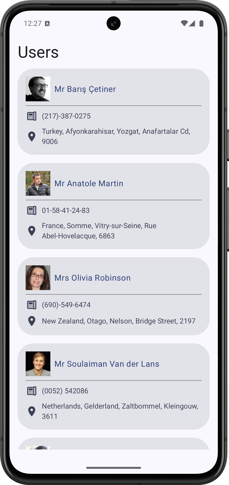
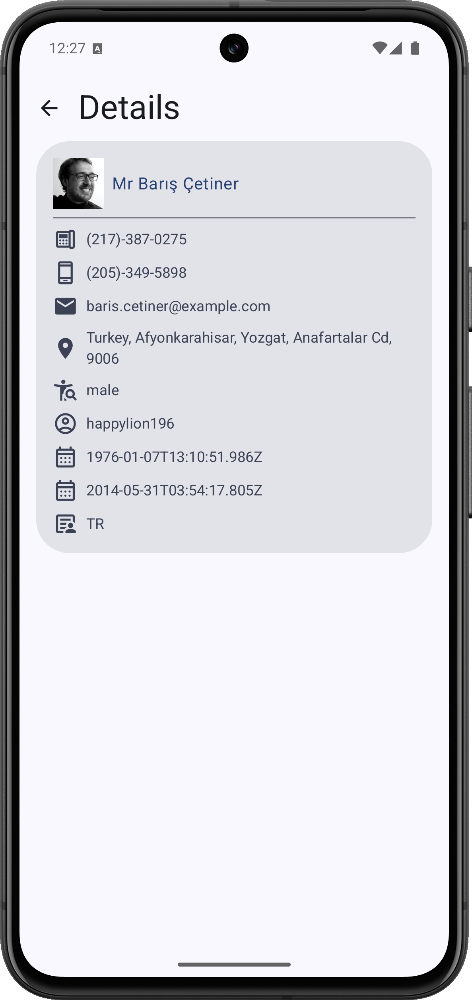

# Тестовое задание. ШИФТ.

## Описание задачи

Реализовать Android-приложение со следующими функциями:

1. Выводится краткая информация о пользователях (ФИО, фотография, адрес, номер телефона) в виде списка, полученная от https://randomuser.me ;
2. По клику на элемент списка на отдельном экране показывается полная информация о выбранном пользователе;
3. Данные о пользователях не теряются при перезапуске приложения;
4. Нажатие на Email, номер телефона, адрес/координаты отправляет пользователя в приложение, которое может обработать эти данные (почта, звонилка, карты);
5. Список пользователей можно обновить принудительно;
6. Пользователю выводятся уведомления о возникших ошибках при загрузке данных или работе с ними.

---

## Используемые технологии и библиотеки

1. **Jetpack Compose**
    - Выбран, потому что это современный декларативный UI-фреймворк от Google, который позволяет быстро строить адаптивный интерфейс без XML, что делает его проще и быстрее в разработке, чем ViewBinding или классические XML-layouts.

2. **Navigation Compose**
    - Используется, так как он нативно встроен в Compose и даёт простой API для навигации и передачи аргументов, избавляя от необходимости писать сложный самописный стек экранов.

3. **Koin**
    - Лёгкий DI-фреймворк без генерации кода и сложных аннотаций, что делает его быстрее и проще в интеграции с Compose по сравнению с Hilt.

4. **Room**
    - Официальный ORM от Google с поддержкой AndroidX и удобной работой с SQLite, поэтому его проще интегрировать и сопровождать, чем Realm или SQLDelight.

5. **Retrofit + OkHttp**
    - Стандарт HTTP-клиента в Android с простым API и отличной интеграцией с Kotlin Serialization, что делает его удобнее Ktor Client в чисто Android-проектах.

6. **Kotlinx Serialization**
    - Нативный сериализатор от JetBrains с поддержкой `data`-классов без сторонних аннотаций, что упрощает работу по сравнению с Gson и Moshi.

7. **Coil**
    - Быстрая и современная библиотека загрузки изображений, оптимизированная под Compose, что делает её легче и адаптивнее, чем Glide или Picasso.

---  

## Принятые решения

1. **Архитектура:**
   Использована MVVM + Clean Architecture разделением на модули:
    - `app` - точка входа, глобальная навигация, DI инициализация.
    - `feature:user` - функционал списка пользователей и экрана деталей пользователя.
        -   `feature:user:api` - usecase'ы, сущности, и направления навигации, доступные другим модулям.
        -   `feature:user:impl` - внутренняя реализация бизнес-логики и работы с данными/
        -   `feature:user:presentation` - UI-слой и ViewModel для отображения данных, обработки пользовательских событий и связи с бизнес-логикой/
    - `feature:database` - локальное хранилище с использованием Room.
    - `common:coroutine` -  вспомогательные классы и обёртки для работы с Kotlin Coroutines.
    - `common:design` - общие UI-компоненты.
    - `common:mvvm` -  унифицированная реализация паттерна MVVM.
    - `common:navigation` -  минимальный набор абстракций для навигации между экранами.
    - `common:network` - API-клиент с использованием Retrofit и OkHttp.
    - `common:resources` -  централизованное хранение строк, иконок и других ресурсов.

   Это упрощает масштабирование и тестирование.

2. **Навигация:**
    - Для глобальной навигации используется единый `NavHost` в `app`.
    - Каждая фича определяет собственный `NavGraph`.

3. **Кэширование данных:**
    - Загруженные пользователи сохраняются в Room.
    - При старте приложения данные берутся из БД, при обновлении из API с перезаписью.

4. **Обработка ошибок:**
    - При первичной загрузке ошибки переводят экран в `ErrorScreen`, при обновлении списка ошибки логируются без потери текущих данных.

5. **Открытие внешних приложений:**
    - `Intent` для звонков (`tel:`), email (`mailto:`) и карт (`geo:`) с поддержкой любых совместимых приложений.

6. **Обновление списка:**
    - `PullToRefreshBox` с флагом `isRefreshing`, данные обновляются через `observeUsersUseCase` без полной перезагрузки экрана.

---

## Скриншоты

### Экран списка пользователей

### Экран деталей пользователя

